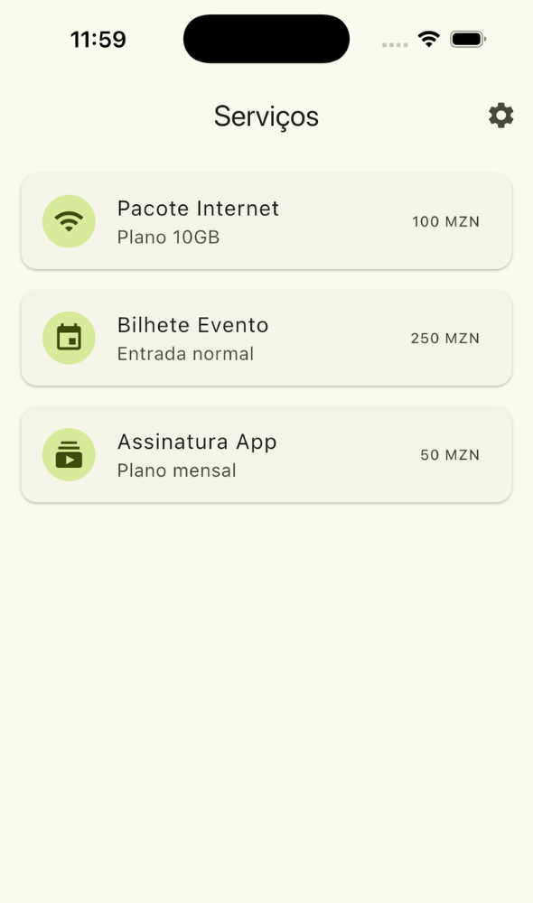
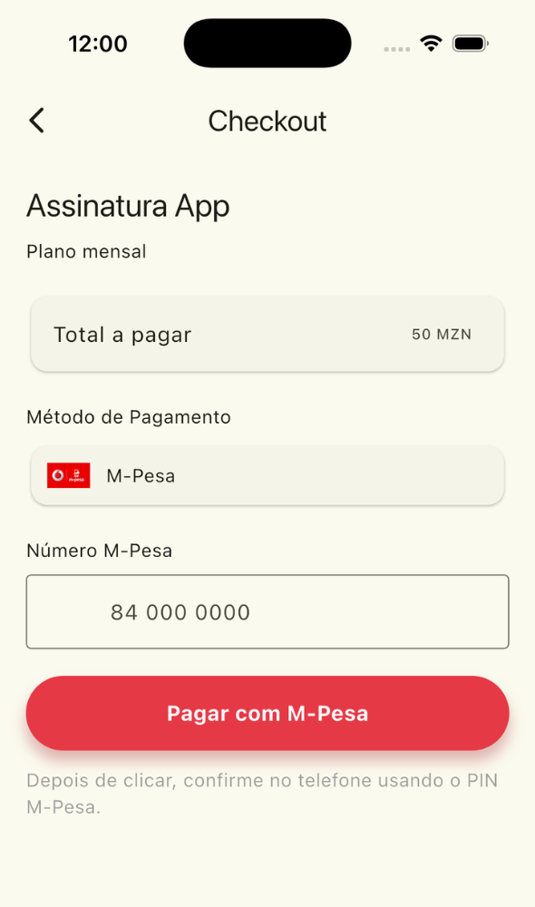
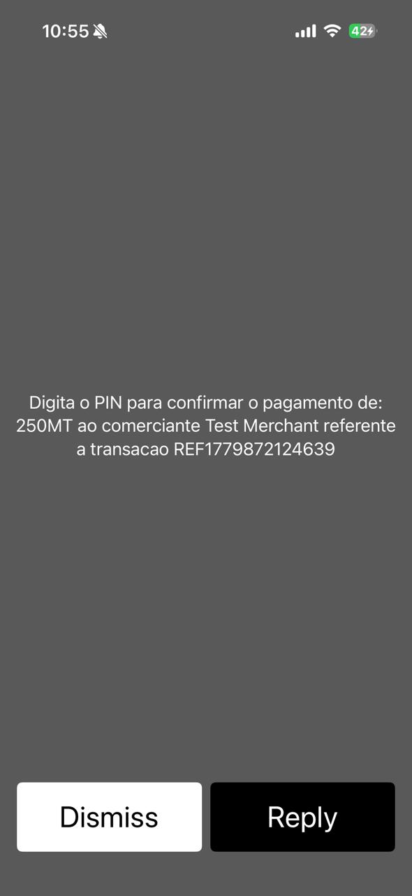
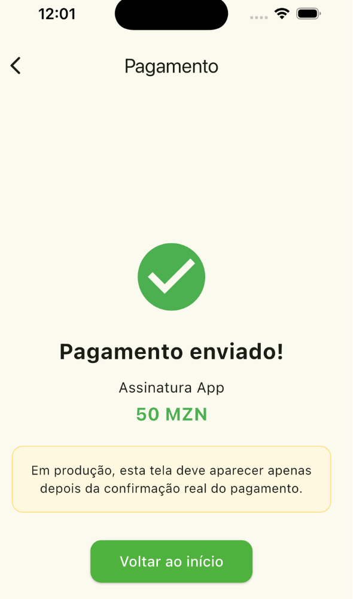

# Flutter M-Pesa Integration - Exemplo de Implementação

> Uma implementação clara e bem documentada da integração com a API de pagamento M-Pesa para desenvolvedores Flutter.

##  Visão Geral

Este projeto foi criado para facilitar a integração da API de pagamento M-Pesa em aplicações Flutter. A documentação oficial era difícil de encontrar e desorganizada, então foi desenvolvida esta solução completa para ajudar outros desenvolvedores.

## 📚 Documentação Oficial

- [Documentação M-Pesa Developer](https://developer.mpesa.vm.co.mz/documentation/)

##  Funcionalidades

- Integração completa com API M-Pesa
- Interface limpa e intuitiva
- Validação de números de telefone
- Confirmação de pagamento
- Página de sucesso com detalhes da transação
- Backend Node.js incluído

## 📱 Telas da Aplicação

### 1. Tela de Serviços
A tela inicial mostra os serviços disponíveis para pagamento.



### 2. Tela de Pagamento
Formulário para inserir o número M-Pesa e confirmar o pagamento.



### 3. Notificação M-Pesa
Confirmação de pagamento recebida no dispositivo.



### 4. Tela de Sucesso
Confirmação da transação completada com detalhes.



## 🚀 Instalação

### Pré-requisitos
- Flutter SDK (3.11.5 ou superior)
- Node.js (para o backend)
- Credenciais M-Pesa válidas

### Passos de Instalação

1. **Clone o repositório**
```bash
git clone https://github.com/Hunchovan/flutter-mpesa-api-c2b.git
cd teste01
```

2. **Configure as variáveis de ambiente**

Crie um arquivo `.env` na pasta `backend_pay/`:

```env
MPESA_API_KEY=sua_api_key_aqui
MPESA_PUBLIC_KEY=sua_public_key_aqui
MPESA_SERVICE_PROVIDER_CODE=seu_codigo_aqui
MPESA_BASE_URL=https://api.sandbox.vm.co.mz:18352
```

Use `.env.example` como referência.

3. **Instale as dependências Flutter**
```bash
flutter pub get
```

4. **Instale as dependências do backend**
```bash
cd backend_pay
npm install
```

5. **Configure o endereço do servidor**

No arquivo `lib/screens/checkout_page.dart`, substitua `youripaddress` pelo IP do seu servidor:

```dart
final mpesaService = MpesaService(backendUrl: 'http://seu_ip:3000');
```

## 🛠️ Como Usar

### Iniciando o Backend

```bash
cd backend_pay
node server.js
```

O servidor rodará na porta 3000.

### Rodando a Aplicação Flutter

```bash
flutter run
```

### Fluxo de Pagamento

1. **Selecione um Serviço**: Na tela inicial, escolha um dos serviços disponíveis
2. **Insira o Número M-Pesa**: Digite um número de telefone válido
3. **Confirme o Pagamento**: Clique em "Pagar com M-Pesa"
4. **Autorize no Dispositivo**: Confirme a transação com seu PIN M-Pesa
5. **Veja o Sucesso**: Após confirmação, você verá a tela de sucesso

## 📁 Estrutura do Projeto

```
teste01/
├── lib/
│   ├── main.dart                 # Entrada da aplicação
│   ├── screens/
│   │   ├── services_page.dart    # Tela de serviços
│   │   ├── checkout_page.dart    # Tela de pagamento
│   │   ├── payment_success_page.dart
│   │   ├── settings_page.dart    # Sobre o projeto
│   │   └── mpesa_service.dart    # Serviço de pagamento
│   └── services/
│       └── mpesa_service.dart    # Integração com API
├── backend_pay/
│   ├── server.js                 # Servidor principal
│   ├── mpesaService.js           # Lógica M-Pesa
│   ├── package.json
│   ├── .env.example
│   └── .env                      # Variáveis de ambiente
├── assets/
│   └── images/
│       └── mpesa_logo.svg
└── README.md
```

## 🔐 Segurança

- ⚠️ **Nunca compartilhe seu arquivo `.env`** - ele contém credenciais sensíveis
- O `.env` está incluído no `.gitignore`
- Sempre use `youripaddress` como placeholder
- Valide todos os números de telefone no backend

## 🌍 Configuração para Produção

Para usar em produção com M-Pesa real:

1. Altere `MPESA_BASE_URL` para a URL oficial (remova sandbox)
2. Atualize as credenciais para produção
3. Configure HTTPS para todas as requisições
4. Implemente autenticação e validação robusta

## 🤝 Contribuindo

Sugestões e melhorias são bem-vindas! Crie uma issue ou pull request.

## 📝 Licença

Este projeto é fornecido como exemplo de implementação.

## 👨‍💻 Desenvolvedor

**Vlad Van Nguila**

> Criado para facilitar a vida dos desenvolvedores integrando M-Pesa em suas aplicações Flutter.

## 📞 Suporte

Se encontrar dúvidas na integração:
1. Verifique a documentação oficial do M-Pesa
2. Confirme que suas credenciais estão corretas
3. Verifique os logs do backend
4. Certifique-se de que o servidor está rodando

---

Versão: 1.0.0
